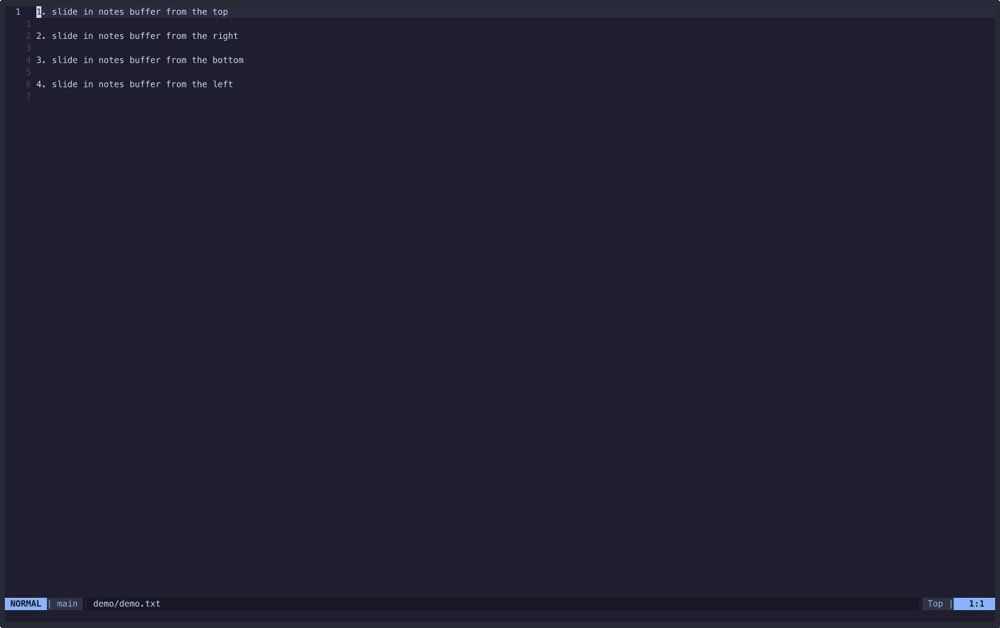

# notes-slider

## Purpose

Slide in a buffer to take notes

## Examples:



## How To Use

Here is how you can install and configure it using [lazy.nvim](https://github.com/folke/lazy.nvim):

```
return {
    "chrisj0110/notes-slider",
    config = function()
        require('notes-slider').setup({
            horizontal_split_size = 15,  -- if omitted, default is 15
            vertical_split_size = 70,  -- default is 70
            scratch_file_prefix = "scratch-", -- default is "scratch-"
            scratch_file_extension = "md", -- default is "txt"
            scratch_file_dir = "~/bin", -- default is $HOME
        })

        -- if you want to use the current tmux session name in the file name, call toggle_scratch_using_tmux_name()
        -- first param is whether you want a horizontal split or a vertical split
        -- second param is whether you want the notes buffer "after" the current one (i.e. "right"/"below" the current one, depending on horizontal vs vertical)
        vim.api.nvim_set_keymap('n', '[s', ':lua require("notes-slider").toggle_scratch_using_tmux_name(false, false)<CR>', { noremap = true, silent = true })
        vim.api.nvim_set_keymap('n', ']s', ':lua require("notes-slider").toggle_scratch_using_tmux_name(true, true)<CR>', { noremap = true, silent = true })

        -- or if you don't want to automatically use the tmux name, just call toggle_scratch()
        -- first two params are the same as above
        -- third param is the text to put in the file name instead of the tmux session name
        vim.api.nvim_set_keymap('n', '[s', ':lua require("notes-slider").toggle_scratch(false, false, "abc")<CR>', { noremap = true, silent = true })
        vim.api.nvim_set_keymap('n', ']s', ':lua require("notes-slider").toggle_scratch(true, true, "abc")<CR>', { noremap = true, silent = true })
    end
}
```

Or you can call functions directly, for example:

`:lua require("notes-slider").toggle_scratch(false, false, "abc")`

Calling the same function/mapping again toggles it open/closed.

